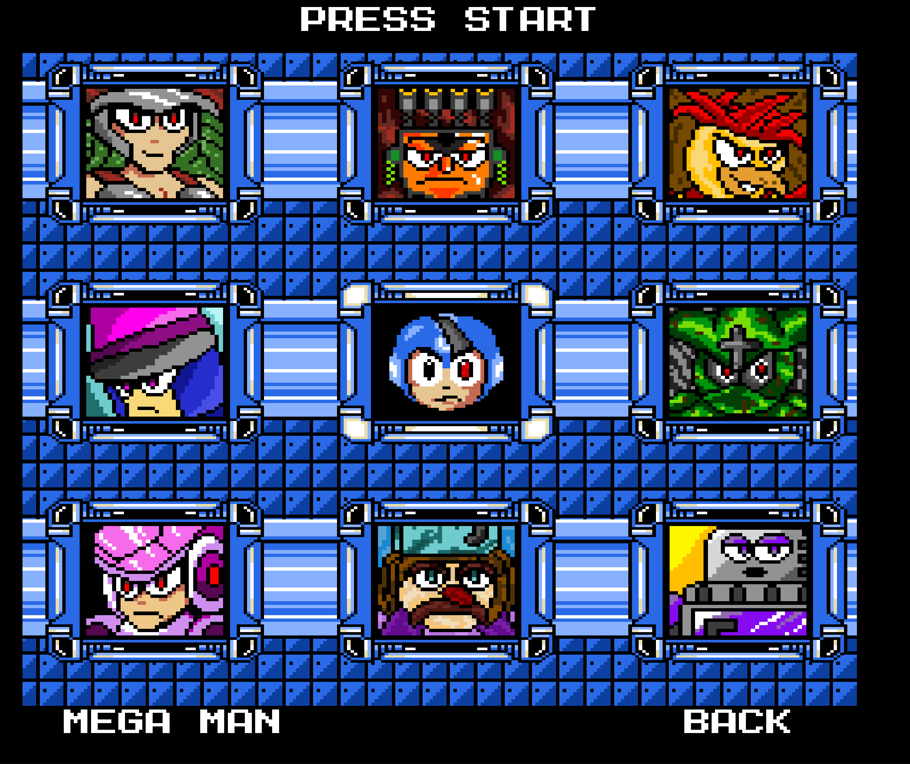

# MEGAMAN MAVERICK

## THE STORY

"The year is 20XX. Megaman was created by Dr. Light to lead the world into peace and prosperity. 
But dreams seldom come true the way they were planned to. Division and hatred spread across Megatropolis!
The robots, malcontent, protest for equal rights. Many humans fear and hate the robots, and the authorities, 
fearing the worst, decree all disobeying robots to be shut down immediately. Outbursts of robots going mad  
in revolt shocks the city! The rioting robots brand themselves the Mavericks. There are rumours of a leader who will 
rise and lead them to 'prosperity and justice'. There are heroes and villians on both sides... Megaman, watching
helplessly, is faced with a dilemna beyond his reckoning. Does he help to shut down those who were once his friends,
or does he set beside his emotions to perform his duty for the human race?... These robots are his brothers 
and sisters... "You're either with us or against us!" both sides cry. There is no right and wrong anymore.
Megaman looks upon the destruction and chaos, and knows what he must do."

## THE PROJECT

A simple fan game I'm working on in my spare time, Written in Java using 
<a href="https://libgdx.com/">LibGDX</a>.

